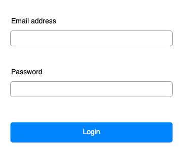
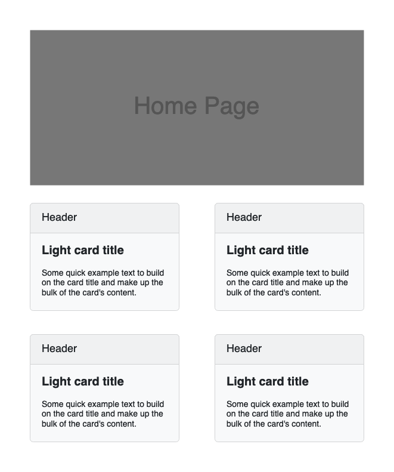

# Login

- [Login](#login)
- [Home](#home)
- [Logout](#logout)

## login

Here is a login page to login. Valid email is `admin@admin.com` and password is  `secret`. Show error message if email or password is incorrect. If email and password is correct, redirect to home page.It should not access after logged in.

## Home

Here is home page. It can be access after logged in. It should not access without logged in.

## Logout

Logout and redirect to login page.
